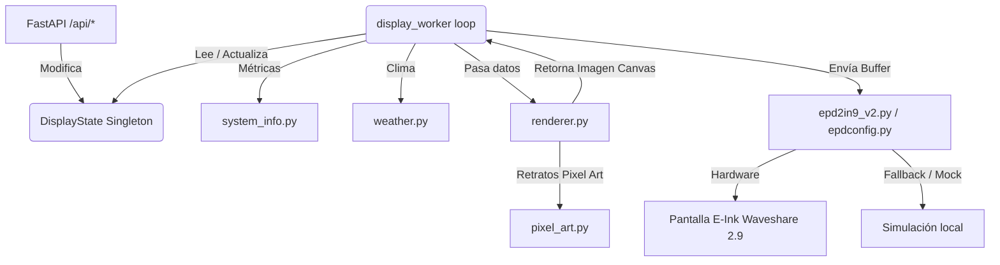

# Análisis del Proyecto y Guía de Flujo de Trabajo Consistente

Este documento proporciona una vista detallada de la arquitectura del proyecto `ink-screen` y define las pautas necesarias para mantener un flujo de trabajo consistente, seguro y robusto.

---

## 🔍 Análisis de la Arquitectura del Proyecto

El proyecto está diseñado bajo un modelo híbrido que ejecuta un **demonio en segundo plano** para gestionar los ciclos de refresco de la pantalla E-Ink, y expone una **interfaz REST API** rápida con FastAPI para interactuar y modificar el estado visual desde la red.



### Componentes Clave

1.  **`src/main.py` (Punto de entrada):**
    *   Crea la aplicación FastAPI.
    *   Arranca `display_worker()` en un hilo asíncrono utilizando el lifespan del framework.
    *   El bucle de actualización corre por defecto cada 60 segundos (o inmediatamente si se activa `state.force_refresh_event` por una llamada API).
2.  **`src/api.py` (Endpoints y Estado Compartido):**
    *   Define el singleton `state` de la clase `DisplayState` que actúa como fuente única de verdad en memoria.
    *   Define los esquemas de validación de datos usando Pydantic.
    *   Expone endpoints REST: `/api/status`, `/api/message`, `/api/clear`, `/api/alert`, `/api/alert/clear`, `/api/refresh`.
3.  **`src/renderer.py` (Renderizado de Canvas PIL):**
    *   Genera un canvas binario (modo `"1"` - 1-bit, blanco y negro) de `296x128` píxeles.
    *   Usa tipografías del sistema para dibujar el panel del sistema (CPU, RAM, disco, IP, Uptime), el panel del clima y los mensajes de texto.
    *   Contiene la lógica de renderizado de la alerta RPG retro a pantalla completa (`render_alert`).
4.  **`src/pixel_art.py` (Biblioteca de Retratos):**
    *   Almacena los diseños de retrato en matrices de texto monocromáticas de 32x32 para Knights, Mages, Slimes, Robots y Hearts.
    *   Ofrece un método helper para convertirlos en imágenes binarias de Pillow listas para escalar con vecinos cercanos (`NEAREST`).
5.  **`src/driver/` (Capa de abstracción de Hardware):**
    *   `epd2in9_v2.py`: Implementa el protocolo de comunicación de bajo nivel para la pantalla Waveshare de 2.9 pulgadas V2.
    *   `epdconfig.py`: Abstrae el uso de pines GPIO y comunicación SPI. Cuenta con detección automática de entorno: si no encuentra la librería `spidev` (ej. en Mac de desarrollo), activa el modo **MOCK** para simular las llamadas sin fallar.

---

## ⚙️ Modos de Ejecución

### 1. Modo de Simulación / Previsualización Local (Mock)
Este modo es perfecto para desarrollo en tu Mac/PC local, ya que no requiere hardware físico.
*   **Comando:** `make run-local` o establecer la variable de entorno `INK_SCREEN_MOCK=1`.
*   **Comportamiento:** El servidor inicia localmente en el puerto `8000`. La pantalla se simula guardando la previsualización de la renderización actual en un archivo PNG en tu sistema (ej: `/tmp/ink_screen_preview.png`).

### 2. Modo Hardware (Orange Pi)
Este es el modo productivo que corre en el dispositivo físico.
*   **Detección:** Se activa automáticamente al detectar e importar correctamente la librería `spidev`.
*   **Comportamiento:** Escribe de forma real sobre el bus SPI físico (/dev/spidev3.0) y controla los pines GPIO de la Orange Pi.

---

## 🔄 Flujo de Trabajo Consistente para Desarrolladores

Para mantener el código en orden y garantizar que no haya fallas en producción, todos los desarrolladores (humanos y agentes IA) deben adherir estrictamente al siguiente flujo de trabajo:

### Paso 1: Desarrollo Basado en Ramas
**Está prohibido subir cambios directamente a la rama `main`.**
1.  Antes de codificar, crea una rama descriptiva basada en `main` limpia:
    ```bash
    git checkout main
    git pull origin main
    git checkout -b feature/nombre-de-funcionalidad
    ```

### Paso 2: Desarrollo y Testing Local
1.  Escribe el código implementando los endpoints en `api.py` y los renders en `renderer.py`.
2.  Agrega las pruebas correspondientes en el directorio `tests/` para asegurar cobertura de API y renderizado.
3.  Ejecuta la suite de pruebas unitarias localmente antes de cualquier deploy:
    ```bash
    make test
    ```
4.  Genera imágenes de prueba ejecutando el renderizador y valídalas visualmente:
    ```bash
    PYTHONPATH=. venv/bin/python src/renderer.py
    ```
    Inspecciona las imágenes creadas en `/tmp/test_default.png`, `/tmp/test_message.png` y `/tmp/test_alert.png` para verificar que el layout no esté roto.

### Paso 3: Despliegue en el Dispositivo (Orange Pi)
1.  Sincroniza el código actual con el dispositivo remoto:
    ```bash
    make deploy
    ```
2.  Reinicia el servicio para aplicar los cambios (esto solicitará la contraseña de `sudo` en el dispositivo):
    ```bash
    make deploy-start
    ```
3.  Monitorea los logs en tiempo real para descartar errores de sintaxis, importación o comunicación SPI:
    ```bash
    make deploy-logs
    ```

### Paso 4: Pruebas de Integración en el Dispositivo
1.  Usa la colección de Bruno ubicada en la carpeta `bruno/` de la raíz del proyecto para enviar peticiones HTTP reales a la API de la Orange Pi.
2.  Verifica físicamente en la pantalla de tinta electrónica que los refrescos (completos o rápidos/parciales) se realicen de manera correcta y limpia.

### Paso 5: Creación del Pull Request (PR)
1.  Realiza el commit y sube tu rama local al servidor remoto:
    ```bash
    git push origin feature/nombre-de-funcionalidad
    ```
2.  Crea el Pull Request a `main` mediante la CLI de GitHub:
    ```bash
    gh pr create --title "feat: Titulo descriptivo" --body "Explicacion de los cambios, pruebas realizadas y resultados"
    ```
3.  **Prohibición de auto-merge:** El PR debe ser aprobado explícitamente por el dueño del repositorio antes de unirse a `main`.

---

## 🛠️ Resolución de Problemas Frecuentes (Troubleshooting)

*   **Error: `ModuleNotFoundError: No module named 'spidev'` localmente**
    *   Es normal en entornos no-Linux. Verifica que la variable `INK_SCREEN_MOCK=1` esté configurada o que dejes que el fallback actúe por defecto.
*   **La pantalla física muestra "ghosting" o texto anterior encimado**
    *   La API fuerza un refresco completo cada 30 ciclos para limpiar la pantalla. Si necesitas limpiarla inmediatamente, puedes disparar un refresco completo forzado llamando al endpoint `POST /api/refresh`.
*   **Error de Permisos GPIO en el Dispositivo**
    *   Asegúrate de haber ejecutado `make deploy-setup` en el dispositivo. Este script instala las reglas `udev` necesarias para permitir que el usuario común `andres` controle los pines GPIO y SPI sin requerir privilegios de superusuario (`sudo`) constantes.
